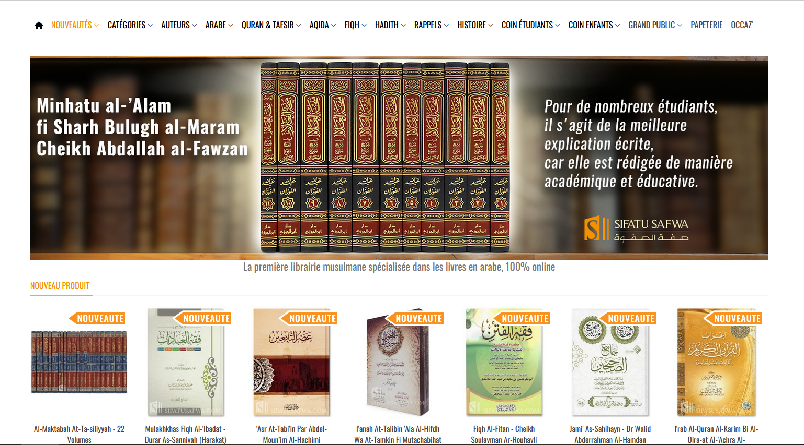
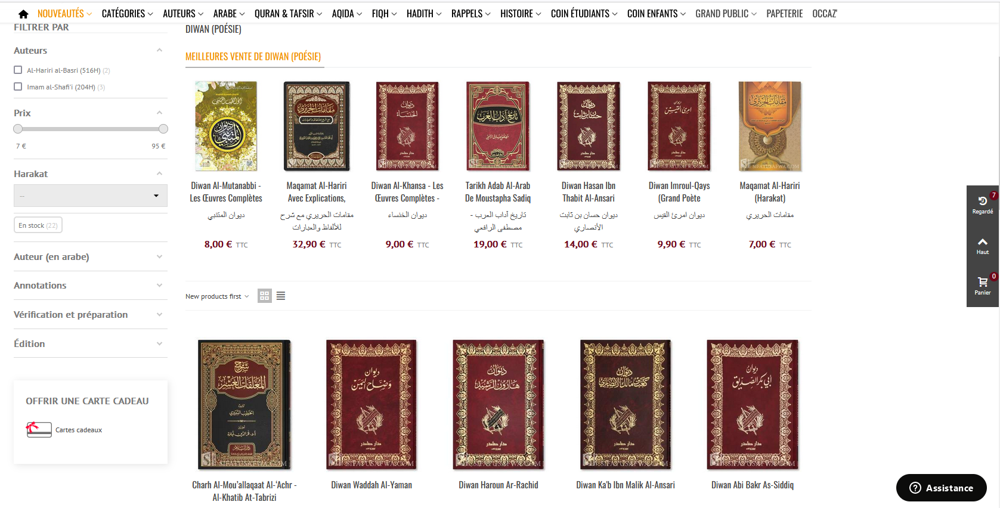

# site_analysis
Le but du projet est de créer une application qui analyse le site sifatusafwa.com

Le site sifatusafwa.com propose des livres en langue arabe, essentiellement dans les sciences islamiques: droit, langue arabe, traditions prophétiques, histoire, poésie, spiritualité... 

Cela peut concerner des débutants avec des manuels par exemple , comme des intermédiaires et confirmés.

Dans un premier temps, l'analyse a pour but de présenter l'étendue du site, en présentant les livres proposés avec un rapport.

Développer un modèle d'apprentissage automatique basés sur le site et les livres qu'il propose est l'objectif final.

## Objectifs et stades du projet
#### **Niveau 1**: Créer des graphiques montrant l’étendue du site (commencer par le fiqh maliki) : un DataFrame avec plusieurs colonnes :
1) Titre français
2) Titre arabe
3) Prix
4) Auteur
5) Domaine /Matière
6) Bref descriptif
7) Date de mort de l’auteur
8) Si possible nombre de volumes
9) Si possible le nombre d’exemplaires disponible (faculatif)
10) Nombre d’éditions disponibles (facultatif)
#### **Niveau 2** : 
Etendre à d’autres domaines : Aqida, puis hadith, histoire, langue arabe... Se contenter pour le moment d’un programme qu’on lancera, sans parler d’automatisation.

#### **Niveau 3**:
Dresser un rapport si possible sur un outil de visualisation mais dont les données ont été travaillées sur Python. On pourra comparer le nombre de livres dans chaque domaine, avec pourquoi pas un domaine par onglet.

#### **(autres niveaux d'objectifs peuvent s'ajouter)**

## Avancées du projet

**24/10/2022** : sifatusafwa-2.ipynb créé une "base de données" de livres, fiqh_maliki.xlsx, objectif 1 réalisé.

